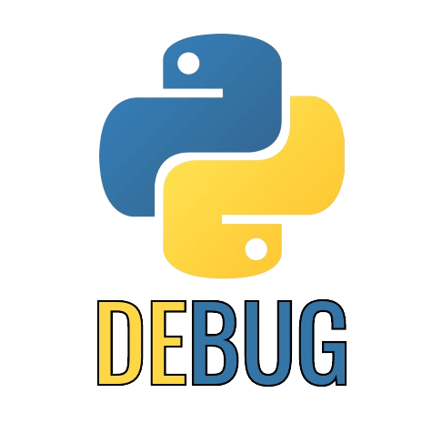

# Python Super Debugger Mode 

Welcome to **Python Super Debugger Mode**, a Visual Studio Code extension designed to enhance your Python debugging experience. This extension provides advanced features for debugging Python code, making it easier to track variable changes, understand code flow, and quickly identify issues.

## Features

- **Automatic Print Statement Insertion**: Effortlessly add print statements to your Python code to track variable values and function calls.
- **Smart Debugging**: Advanced debugging features tailored specifically for Python.
- **Code Flow Analysis**: Understand how your Python code executes, making it easier to spot logical errors and unexpected behavior.

## Installation

You can install the **Python Super Debugger Mode** extension directly from the Visual Studio Code Marketplace:

1. Open Visual Studio Code.
2. Navigate to the Extensions view by clicking on the Extensions icon in the Activity Bar on the side of the window.
3. Search for "Python Super Debugger Mode".
4. Click on the Install button.

## Usage

To start using the extension:

- **Add Print Statements**: Place your cursor in a Python file and use the command "Add Print Statements to current script" to automatically insert print statements.
- **Remove Print Statements**: Clean up your code by using the command "Remove Print Statements" to remove all inserted print statements.

## Contributing

Contributions to **Python Super Debugger Mode** are welcome! Whether it's bug reports, feature requests, or code contributions, your input is valuable. Please feel free to open an issue or submit a pull request on our [GitHub repository](#).

## Author

**Python Super Debugger Mode** is developed by Siddharth Verma, dedicated to improving Python development in VS Code.

## License

This extension is released under the [MIT License](LICENSE).

---

Happy Coding!
